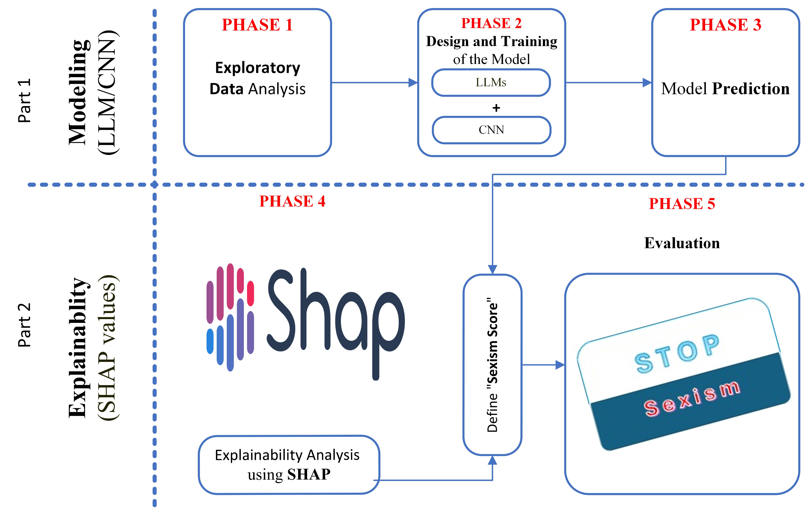
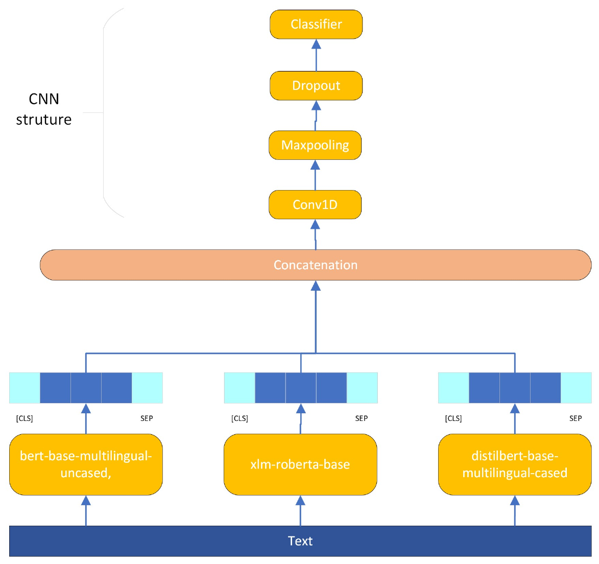

<div align="center">

# Explainable Sexism Detection

### A Transparent Pipeline for Sexism Detection in Social Media

[](https://www.mdpi.com/2076-3417/14/19/8620)
[](https://doi.org/10.3390/app14198620)
[](https://creativecommons.org/licenses/by/4.0/)
[](https://www.python.org/downloads/)

*Explainable sexism detection combining XAI, feature selection, and ensemble learning*

[Paper](https://www.mdpi.com/2076-3417/14/19/8620) • [Website](https://mohammadi.cv)

---

</div>

## Paper

**Title:** A Transparent Pipeline for Online Sexism Detection Based on the Combination of Explainable Artificial Intelligence, Feature Selection, and Ensemble Learning

**Authors:** Hadi Mohammadi, Anastasia Giachanou, Ayoub Bagheri

**Affiliation:** Utrecht University, The Netherlands

**Journal:** Applied Sciences, 2024

**DOI:** [10.3390/app14198620](https://doi.org/10.3390/app14198620)

## Abstract

Sexism in social media has become a significant societal problem, with automatic detection systems playing a crucial role in content moderation. This paper presents a transparent pipeline for sexism detection that combines:

1. **Multi-model Ensemble**: Combining classical ML (SVM, Random Forest, XGBoost) with deep learning (BERT, RoBERTa)
2. **Feature Selection**: Identifying the most discriminative features for sexism detection
3. **Explainable AI**: Using SHAP and LIME to provide interpretable predictions
4. **Human-in-the-Loop**: Validating model explanations with human annotators

<div align="center">

<br><i>Overview of the transparent sexism detection pipeline</i>
</div>

## Key Contributions

- Transparent detection pipeline with interpretable predictions
- Analysis of linguistic patterns associated with sexist content
- Comparison of explanation methods (SHAP vs LIME) for text classification
- Human evaluation of model explanations

<div align="center">

<br><i>Ensemble model architecture combining ML and DL approaches</i>
</div>

## Repository Contents

```
Explainable-Sexism-Detection/
├── paper.pdf              # Published paper
├── figures/               # All figures and visualizations
│   ├── methodology.png    # Pipeline overview
│   ├── model.png          # Model architecture
│   └── EDA*.png           # Exploratory data analysis
├── latex/                 # LaTeX source files
└── data/                  # Dataset information
```

## Quick Start

```bash
# Clone the repository
git clone https://github.com/mohammadi-hadi/Explainable-Sexism-Detection.git
cd Explainable-Sexism-Detection

# View the paper
open paper.pdf
```

## Citation

```bibtex
@article{mohammadi2024transparent,
  title={A Transparent Pipeline for Online Sexism Detection Based on the Combination of Explainable Artificial Intelligence, Feature Selection, and Ensemble Learning},
  author={Mohammadi, Hadi and Giachanou, Anastasia and Bagheri, Ayoub},
  journal={Applied Sciences},
  volume={14},
  number={19},
  pages={8620},
  year={2024},
  publisher={MDPI}
}
```

## Related Work

This research is part of the PhD thesis "From Tokens to Thoughts: Explainable NLP for Understanding Large Language Models" by Hadi Mohammadi at Utrecht University (2025).

## License

This work is licensed under [CC BY 4.0](https://creativecommons.org/licenses/by/4.0/).

## Contact

- Hadi Mohammadi - [h.mohammadi@uu.nl](mailto:h.mohammadi@uu.nl)
- Website: [mohammadi.cv](https://mohammadi.cv)
