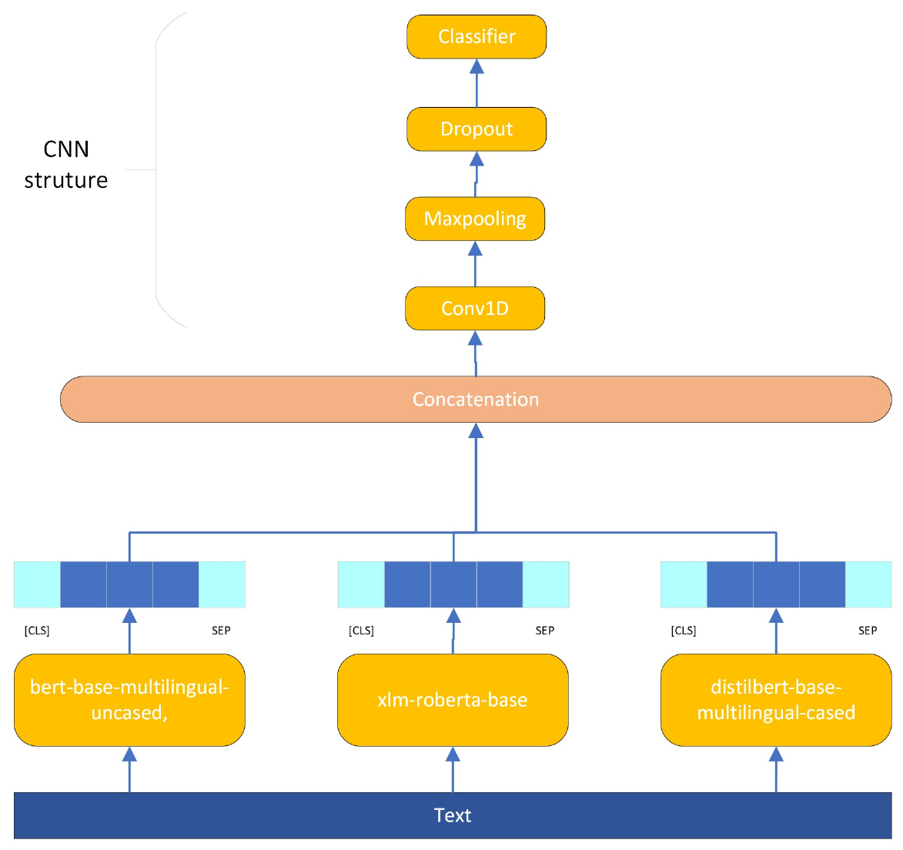

<div align="center">

# A Transparent Pipeline for Identifying Sexism in Social Media

[](https://doi.org/10.5281/zenodo.20091834)
[](https://doi.org/10.3390/app14198620)
[](LICENSE)

*BERT + SHAP + ensemble learning for transparent sexism detection in social media.*

</div>

## Paper

|                  |                                                                          |
| ---------------- | ------------------------------------------------------------------------ |
| **Title**        | A Transparent Pipeline for Online Sexism Detection Based on the Combination of Explainable Artificial Intelligence, Feature Selection, and Ensemble Learning |
| **Authors**      | Hadi Mohammadi, Anastasia Giachanou, Robert A. Bagheri |
| **Affiliation**  | Utrecht University, The Netherlands |
| **Venue**        | Applied Sciences, 14(19), 8620 |
| **DOI (paper)**  | [10.3390/app14198620](https://doi.org/10.3390/app14198620) |
| **Code archive** | [10.5281/zenodo.20091834](https://doi.org/10.5281/zenodo.20091834) (this repository, snapshot v1.0-thesis) |

> This repository accompanies **Chapter 3** of the PhD thesis
> *Let Me Explain! Explainable NLP for Understanding Large Language Models* (Hadi Mohammadi, Utrecht University, 2026).

## Abstract

Sexism detection on social media is a high-stakes content-moderation task where transparency in model decisions is essential for moderators to verify and trust the system. This work develops a transparent pipeline that combines BERT-based classification with SHAP explanations and feature selection, allowing moderators to inspect the lexical and contextual cues that drove each prediction. Evaluated on benchmark datasets, the pipeline achieves competitive accuracy while exposing the words and phrases responsible for each decision.

## Citation

If you use this code or data, please cite **both** the paper and this code archive:

```bibtex
@article{mohammadi2024explainable,
  title         = {A Transparent Pipeline for Online Sexism Detection Based on the Combination of Explainable Artificial Intelligence, Feature Selection, and Ensemble Learning},
  author        = {Mohammadi, Hadi and Giachanou, Anastasia and Bagheri, Robert A.},
  year          = {2024},
  journal       = {Applied Sciences},
  doi           = {10.3390/app14198620}
}

@software{mohammadi_explainable_sexism_detection_2026,
  author    = {Mohammadi, Hadi and Giachanou, Anastasia and Bagheri, Robert A.},
  title     = {A Transparent Pipeline for Identifying Sexism in Social Media},
  year      = {2026},
  publisher = {Zenodo},
  version   = {v1.0-thesis},
  doi       = {10.5281/zenodo.20091834},
  url       = {https://doi.org/10.5281/zenodo.20091834}
}
```

---

## Key Contributions

- Transparent detection pipeline with interpretable predictions
- Analysis of linguistic patterns associated with sexist content
- Comparison of explanation methods (SHAP vs LIME) for text classification
- Human evaluation of model explanations

<div align="center">

<br><i>Ensemble model architecture combining ML and DL approaches</i>
</div>

## Repository Structure

```
Explainable-Sexism-Detection/
├── README.md
├── LICENSE
├── CITATION.cff
├── CONTRIBUTING.md
├── paper.pdf                                     # Published Applied Sciences (2024) paper
├── code/
│   └── custom_model.py                           # Multilingual BERT + XLM-R + DistilBERT ensemble
├── notebooks/
│   ├── BERT_model.ipynb                          # BERT classifier on EXIST 2023/2024
│   ├── PyTorch_BERT_training.ipynb               # PyTorch training pipeline
│   ├── EXIST2024.ipynb                           # EXIST 2024 task analysis
│   ├── EXIST_technical_report.ipynb              # Shared-task technical report notebook
│   ├── LLama_70B.ipynb                           # LLaMA-70B sexism evaluation (English)
│   └── LLama_70B_Spanish.ipynb                   # LLaMA-70B sexism evaluation (Spanish)
├── data/
│   ├── ethics_reference.md                       # Data sources and ethics statement
│   ├── significant_tokens.csv                    # SHAP token importances
│   ├── EXIST2024_training_Task1.csv              # EXIST 2024 Task 1 training subset
│   ├── train_all_tasks.csv                       # Aggregated training data across tasks
│   ├── train_df_augmented.csv                    # Back-translation augmented training
│   ├── final_dataframe_with_sexism_scores.csv    # Per-tweet sexism predictions
│   ├── final_dataframe_with_shap_scores.csv      # Per-tweet SHAP token attributions
│   ├── df_lang_es.csv                            # Spanish-only annotated subset
│   ├── coef_df.csv                               # Logistic-regression coefficients
│   ├── important_tokens1_es.csv                  # Top SHAP tokens (Spanish)
│   ├── important_words_general.csv               # Top SHAP words (overall)
│   ├── token_overlaps_Spanish.csv                # Token-overlap matrix across categories
│   ├── clean_data_en_demographic_statistics.csv  # Demographic-group annotation stats (EN)
│   ├── clean_data_es_demographic_statistics.csv  # Demographic-group annotation stats (ES)
│   ├── genai_results.csv                         # GenAI/GenP/GenXAI/GenPXAI scenario predictions
│   └── demographic_word_importance/              # 45 per-demographic SHAP-token CSVs
└── figures/
    ├── methodology.{png,pdf}                     # Pipeline overview
    ├── model.{png,pdf}                           # Model architecture
    ├── backtranslation.pdf                       # Back-translation augmentation diagram
    ├── histogram.pdf                             # Token-importance histogram
    ├── importance.pdf                            # Per-token importance plot
    ├── threshold.pdf                             # Decision-threshold curve
    ├── histogram_sexism_scores.pdf               # Distribution of sexism scores
    ├── selected_tokens_vs_threshold.pdf          # Token-selection vs threshold curve
    ├── cumulative_importance_general.png         # Cumulative SHAP importance
    ├── num_tokens_95_cumulative_importance.png   # Tokens needed for 95% importance
    ├── percentage_repeated_unique_tokens.png     # Repeated-vs-unique token share
    ├── repeated_unique_tokens_Spanish.png        # Spanish repeated-vs-unique tokens
    ├── repeated_unique_tokens_top_100_Spanish.png# Top-100 Spanish tokens
    ├── unique_tokens_across_categories_Spanish.png # Unique tokens per category (ES)
    └── EDA1.png … EDA6.png                       # Exploratory data analysis
```

> **Note on data:** Raw EXIST 2023/2024 tweet text is included in some CSVs to support reproducibility of the SHAP and demographic analyses. The original shared-task data is © the EXIST organisers; please cite their papers and respect their terms of use when redistributing or reusing.

## Quick Start

```bash
git clone https://github.com/mohammadi-hadi/Explainable-Sexism-Detection.git
cd Explainable-Sexism-Detection
open paper.pdf                      # macOS; or use any PDF viewer

# To run the analysis notebooks
pip install pandas numpy torch transformers scikit-learn shap matplotlib seaborn
jupyter lab notebooks/
```

The paper provides full methodology and references the figures in `figures/`. SHAP token importances aggregated over the test set are in `data/significant_tokens.csv`; per-demographic-group SHAP attributions are in `data/demographic_word_importance/`.

## License

This work is licensed under [CC BY 4.0](https://creativecommons.org/licenses/by/4.0/).

## Contact

- **Hadi Mohammadi** — Utrecht University
- Website: [mohammadi.cv](https://mohammadi.cv)
